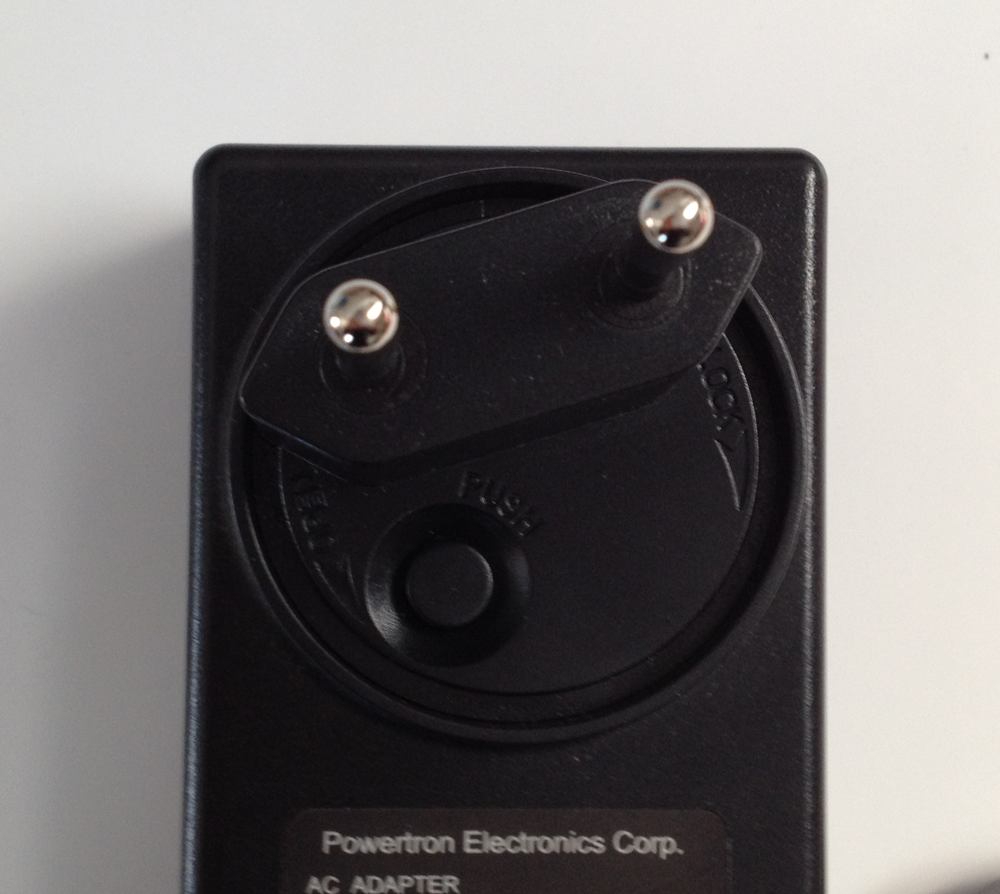

Power-On
========

The board is shipped with an external power adapter with two different socket adapters.

Sort out the socket adapter that is right for you. Place it properly.

Push it and rotate it clockwise until you hear a slight click.

To power-on the board, just connect the external power adapter to ZedBoard connector **J20**
and move switch **SW8** to the "On" position.
