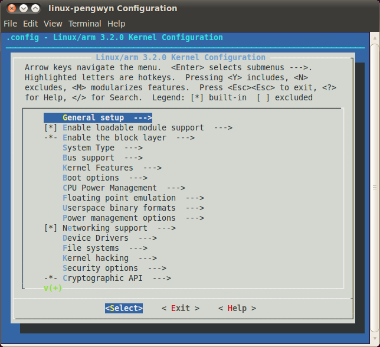

***
BSP
***

The Board Support Package is composed by a set files, patches, recipes, configuration files, etc.
This chapter gives you the information you need when you want to customize something, fix a bug,
or simply learn how the all thing has been assembled.

.. _bsp_bootloader_label:
.. include:: bootloader.rst

.. include:: kernel.rst

Build from bitbake
------------------

The most frequent way of customization of the Linux Kernel is to change the .config file that contains the Kernel options. Setup the environment and run:

.. raw:: html

 

 
<b class="admonition-host">&nbsp;&nbsp;Host&nbsp;&nbsp;</b>&nbsp;&nbsp;<a style="float: right;" href="javascript:select_text( 'bsp_rst-host-131' );">select</a>

 <pre class="line-numbers pre-replacer" data-start="1"><code id="bsp_rst-host-131" class="language-markup">bitbake virtual/kernel -c cleanall
 bitbake virtual/kernel -c menuconfig</code></pre>
 
 
 

a new window, like the following one, will pop-up:

follow the instructions, save and exit, than you ready to generate your preferred image based on your customized kernel. If you prefer, you can build just the kernel running:

.. raw:: html

 

 
<b class="admonition-host">&nbsp;&nbsp;Host&nbsp;&nbsp;</b>&nbsp;&nbsp;<a style="float: right;" href="javascript:select_text( 'bsp_rst-host-132' );">select</a>

 <pre class="line-numbers pre-replacer" data-start="1"><code id="bsp_rst-host-132" class="language-markup">bitbake virtual/kernel</code></pre>
 
 
 

At the end of the build process, the output file (uImage.bin), along with the built kernel modules, will be placed under *tmp/deploy/images/zedboard-zynq7/* inside your build directory, so, if you are building your system from the default directory, the destination directory will be */home/architech/architech_sdk/architech/zedboard/yocto/build/tmp/deploy/images/zedboard-zynq7/*.

.. include:: meta_layer.rst

.. _rootfs_label:

.. include:: rootfs.rst