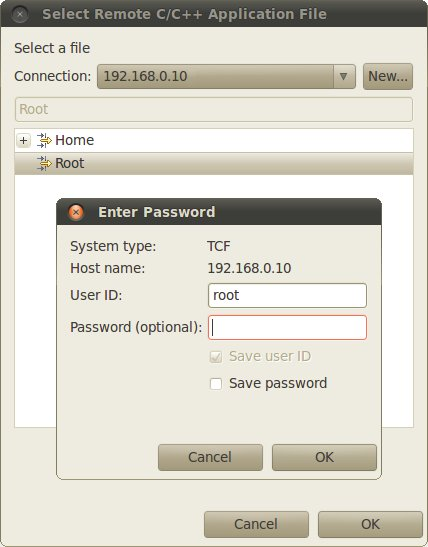

Eclipse
=======

Eclipse is an integrated development environment (IDE). It contains a base workspace
and the Yocto plug-in system to compile and debug a program for ZedBoard. Hereafter,
the operating system that runs the IDE/debugger will be named host machine, and the
board being debugged will be named target machine. The host machine could be running
as a virtual machine guest operating system, anyway, the documentation for the host
machine running as a guest operating system and as host operating system is exactly
the same.

To write your application you need:

* a root file system filesystem (you can use :ref:`bitbake <bitbake_label>`/:ref:`hob <hob_label>` to build your preferred filesystem) with development support (that is, it must include all the necessary libraries, header files, the *tcf-agent* program and *gdbserver*) included

* a media with the :ref:`root filesystem <rootfs_label>` installed and, if necessary, the bootloader

* ZedBoard :ref:`powered up <poweron_label>` with the aforementioned root file system

* a working :ref:`serial console <serial_console_label>` terminal

* a working :ref:`network <network_label>` connection between your workstation and the board (connector *J11*), so, be sure that:

 1. your board has ip address 192.168.0.10 on interface eth0, and

 2. your PC has an ip address in the same family of addresses, e.g. 192.168.0.100. 

.. index:: Project

Creating the Project
--------------------

You can create two types of projects: Autotools-based, or Makefile-based. This section describes how to create Autotools-based projects from within the **Eclipse IDE**.
Launch Eclipse using Architech Splashscreen just click on **Develop with Eclipse**.

To create a project based on a Yocto template and then display the source code, follow these steps:

* Select File→New→Project...
* Under *C/C++*, double click on *C Project* to create the project.
* Click on "Next" button
* Expand *Yocto Project ADT Autotools Project*.
* Select *Hello World ANSI C Autotools Project*. This is an Autotools-based project based on a Yocto Project template.

.. image:: _static/eclipse-new-project.jpg
    :align: center

* Put a name in the Project *name:* field. Do not use hyphens as part of the name.
* Click *Next*.
* Add information in the *Author* and *Copyright* notice fields.
* Be sure the *License* field is correct.
* Click *Finish*.

.. note::

 If the "open perspective" prompt appears, click *Yes* so that you enter in C/C++ perspective. The left-hand navigation panel shows your project. You can display your source by double clicking on the project source file.

.. image:: _static/projectexplorer.jpg
    :align: center
 
* Select *Project→Properties→Yocto Project Settings* and check *Use project specific settings*

Building the Project
--------------------

To build the project, select Project→Build Project. The console should update with messages from the cross-compiler.
To add more libraries to compile:

* Click on Project→Properties.
* Expand the box next to Autotools.
* Select Configure Settings.
* In CFLAGS field, you can add the path of includes with -Ipath_include
* In LDFLAGS field, you can specify the libraries you use with -lname_library and you can also specify the path where to look for libraries with -Lpath_library
* Click on Project→Build All to compile the project

.. note::

 All libraries must be located in */home/architech/architech_sdk/architech/zedboard/sysroot* subdirectories.

.. index:: Debug

Deploying and Debugging the Application
---------------------------------------

Connect ZedBoard console to your PC and power-on the board. Once you built the project and the board is running the image, use minicom to run **tcf-agent** program in target board:

.. raw:: html

 

 
<b class="admonition-board">&nbsp;&nbsp;Board&nbsp;&nbsp;</b>&nbsp;&nbsp;<a style="float: right;" href="javascript:select_text( 'eclipse_rst-board-211' );">select</a>

 <pre class="line-numbers pre-replacer" data-start="1"><code id="eclipse_rst-board-211" class="language-markup">zedboard login: root
 /etc/init.d/tcf-agent restart</code></pre>
 
 
 

On the Host machine, follow these steps to let **Eclipse** deploy and debug your application:

* Select Run→Debug Configurations...
* In the left area, expand *C/C++ Remote Application*.
* Locate your project and select it to bring up a new tabbed view in the *Debug Configurations* Dialog.

.. image:: _static/debugform.jpg
    :align: center

* Insert in *C/C++ Application* the filepath of your application binary on your host machine.
* Click on "New" button near the drop-down menu in the *Connection* field.
* Select *TCF* icon.

.. image:: _static/tcf1.jpg
    :align: center

* Insert in *Host Name* and *Connection Name* fields the IP address of the target board. (e.g. 192.168.0.10)

.. image:: _static/tcf2.jpg
    :align: center

* Press *Finish*.

* Use the drop-down menu now in the *Connection* field and pick the IP Address you entered earlier.

* Enter the absolute path on the target into which you want to deploy the application. Use *Browse* button near *Remote Absolute File Path for C/C++Application:* field. No password is needed.

* Enter also in the path the name of the application you want to debug. (e.g. Hello)

.. image:: _static/debug2.jpg
    :align: center

* Select *Debugger* tab

* In GDB Debugger field, insert the filepath of gdb for your toolchain

.. raw:: html

 

 
<b class="admonition-host">&nbsp;&nbsp;Host&nbsp;&nbsp;</b>&nbsp;&nbsp;<a style="float: right;" href="javascript:select_text( 'eclipse_rst-host-31' );">select</a>

 <pre class="line-numbers pre-replacer" data-start="1"><code id="eclipse_rst-host-31" class="language-markup">/home/architech/architech_sdk/architech/zedboard/toolchain/sysroots/i686-pokysdk-linux/usr/bin/arm-poky-linux-gnueabi/arm-poky-linux-gnueabi-gdb</code></pre>
 
 
 

* In *Debugger* window there is a tab named *Shared Library*, click on it.
* Add the libraries paths *lib* and *usr/lib* of the rootfs (which must be the same used in the target board)

.. raw:: html

 

 
<b class="admonition-host">&nbsp;&nbsp;Host&nbsp;&nbsp;</b>&nbsp;&nbsp;<a style="float: right;" href="javascript:select_text( 'eclipse_rst-host-32' );">select</a>

 <pre class="line-numbers pre-replacer" data-start="1"><code id="eclipse_rst-host-32" class="language-markup">/home/architech/architech_sdk/architech/zedboard/sysroot/lib
 /home/architech/architech_sdk/architech/zedboard/sysroot/usr/lib</code></pre>
 
 
 

* Click *Debug* to bring up a login screen and login.
* Accept the debug perspective. 

.. important::

 If debug does not work, check on the board if *tcf-agent* is running and *gdbserver* has been installed.