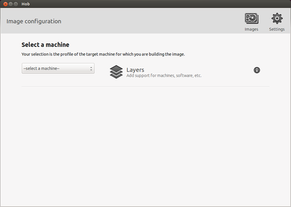

.. _howToUseHOB:

Hob
===

Hob is a graphical interface for Bitbake. It can be called once Bitbake environment has been setup (see
:ref:`bitbake_label`) like this:

.. host::

 hob

once open, you are required to select the machine you want to compile against

after that, you can select the image you want to build and, of course, you can customize it.