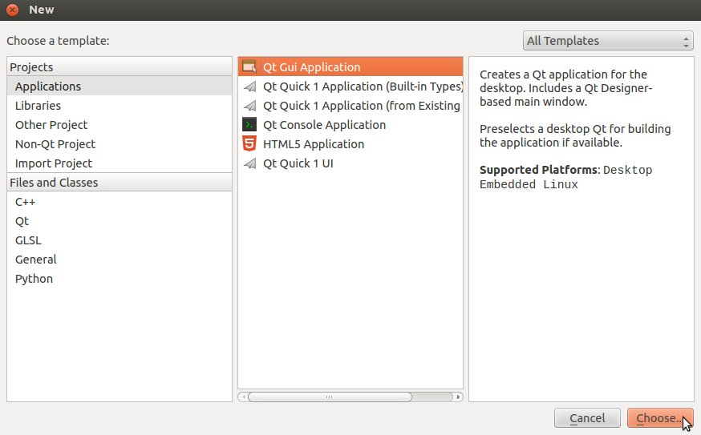
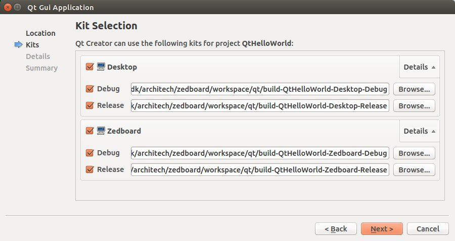
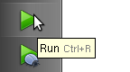
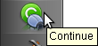

.. _qt_creator_label:

Qt Creator
==========

.. image:: _static/qt-0.png
	   :align: left

| **Qt** is a cross-platform application framework that is used to build applications. One of the best features of Qt is its capability of generating Graphical User Interfaces (GUIs).
| **Qt Creator** is a cross-platform C++ IDE which includes a visual debugger, an integrated GUI layout and form designer. It makes possible to compile and debug applications on both **x86** (host) and **ARM** (target) machines.
| This SDK relies on **version 4.8.5** of Qt and **version 2.8.1** of Qt Creator.

|
|
| Before getting our hands dirty, make sure all these steps have been followed:

1. Use :ref:`Hob <howToUseHOB>` or :ref:`Bitbake <bitbake_label>` to build an image which includes: *openssh*, support for C++, *tcf-agent* and *gdbserver*.

.. note::

 | To follow this guide build *qt4e-demo-image* image. Remember to complete its file system (by the local.conf) with *tcf-agent*, *gdbserver* and *openssh*.
 | 
 | If the borad uses the touchscreen add the following line into the local.conf:
 | IMAGE_INSTALL_append = " tslib tslib-conf tslib-tests tslib-calibrate"
 | Remove from the local.conf the recipe **bluez5**

2. Deploy the :ref:`root file system <rootfs_label>` just generated on the final media used to boot the board

3. Replicate the same root file system into directory: */home/architech/architech_sdk/architech/zedboard/sysroot*

.. raw:: html

 

 
<b class="admonition-host">&nbsp;&nbsp;Host&nbsp;&nbsp;</b>&nbsp;&nbsp;<a style="float: right;" href="javascript:select_text( 'qt_creator_rst-host-171' );">select</a>

 <pre class="line-numbers pre-replacer" data-start="1"><code id="qt_creator_rst-host-171" class="language-markup">sudo tar -xzf /home/architech/architech_sdk/architech/zedboard/yocto/build/tmp/deploy/images/zedboard/qt4e-demo-image-zedboard.tar.gz -C /home/architech/architech_sdk/architech/zedboard/sysroot/</code></pre>
 
 
 

4. Copy the Qt Libraries and cpp libraries to your sdk sysroot directory

.. raw:: html

 

 
<b class="admonition-host">&nbsp;&nbsp;Host&nbsp;&nbsp;</b>&nbsp;&nbsp;<a style="float: right;" href="javascript:select_text( 'qt_creator_rst-host-172' );">select</a>

 <pre class="line-numbers pre-replacer" data-start="1"><code id="qt_creator_rst-host-172" class="language-markup">sudo cp -r /home/architech/architech_sdk/architech/zedboard/toolchain/sysroots/armv7a-vfp-neon-poky-linux-gnueabi/* /home/architech/architech_sdk/architech/zedboard/sysroot
 sudo chown -R architech:architech /home/architech/architech_sdk/architech/zedboard/sysroot</code></pre>
 
 
 

5. Copy the Qt Libraries to the board media used to boot

.. raw:: html

 

 
<b class="admonition-host">&nbsp;&nbsp;Host&nbsp;&nbsp;</b>&nbsp;&nbsp;<a style="float: right;" href="javascript:select_text( 'qt_creator_rst-host-173' );">select</a>

 <pre class="line-numbers pre-replacer" data-start="1"><code id="qt_creator_rst-host-173" class="language-markup">sudo cp -r /home/architech/architech_sdk/architech/zedboard/sysroot/* /path/to/sd/card/rootfs</code></pre>
 
 
 

and edit the file /path/to/sd/card/rootfs/etc/passwd, change the line

.. raw:: html

 

 
<b class="admonition-host">&nbsp;&nbsp;Host&nbsp;&nbsp;</b>&nbsp;&nbsp;<a style="float: right;" href="javascript:select_text( 'qt_creator_rst-host-174' );">select</a>

 <pre class="line-numbers pre-replacer" data-start="1"><code id="qt_creator_rst-host-174" class="language-markup">root:x:0:0:root:/home/root:/bin/sh</code></pre>
 
 
 

to:

.. raw:: html

 

 
<b class="admonition-host">&nbsp;&nbsp;Host&nbsp;&nbsp;</b>&nbsp;&nbsp;<a style="float: right;" href="javascript:select_text( 'qt_creator_rst-host-175' );">select</a>

 <pre class="line-numbers pre-replacer" data-start="1"><code id="qt_creator_rst-host-175" class="language-markup">root::0:0:root:/home/root:/bin/sh</code></pre>
 
 
 

6. To enable the framebuffer we suggest to use the logicbricks kernel downloading from `official logicbricks page <http://www.logicbricks.com/logicBRICKS/Reference-logicBRICKS-Design/Xylon-Reference-Designs-Navigation-Page.aspx>`_ the **logiREF-ZGPU-ZED** Graphics Processing Unit (April 24, 2015). Installing the jar file you will find the uImage and boot.bin files to put in **boot partition of the mmc card**. These files, boot.bin and uImage, are located in *software/ready_for_download/linux_sd*. You need compile the dts file downloading it `devicetree_hdmi.dts <_static/devicetree_hdmi.dts>`_ (see paragraph :ref:`Linux Kernel <bsp_kernel_label>`), to avoid this step you can download the already compiled version `devicetree_hdmi.dtb <_static/devicetree_hdmi.dtb>`_.

7. Unmount the media used to boot the board from your computer and insert it into the board

8. :ref:`Power-On <poweron_label>` the board

9. Open up the :ref:`serial console <serial_console_label>`.

10. Enter in the u-boot prompt and run the following commands:

.. raw:: html

 

 
<b class="admonition-board">&nbsp;&nbsp;Board&nbsp;&nbsp;</b>&nbsp;&nbsp;<a style="float: right;" href="javascript:select_text( 'qt_creator_rst-board-281' );">select</a>

 <pre class="line-numbers pre-replacer" data-start="1"><code id="qt_creator_rst-board-281" class="language-markup">setenv bootargs "console=ttyPS0,115200 root=/dev/mmcblk0p2 rw earlyprintk rootwait"
 fatload mmc 0 0x3000000 uImage
 fatload mmc 0 0x2A00000 devicetree_hdmi.dtb
 bootm 0x3000000 - 0x2A00000</code></pre>
 
 
 

If you based your root file system on *qt4e-demo-image*, be sure you execute this command

.. raw:: html

 

 
<b class="admonition-board">&nbsp;&nbsp;Board&nbsp;&nbsp;</b>&nbsp;&nbsp;<a style="float: right;" href="javascript:select_text( 'qt_creator_rst-board-282' );">select</a>

 <pre class="line-numbers pre-replacer" data-start="1"><code id="qt_creator_rst-board-282" class="language-markup">/etc/init.d/qtdemo stop</code></pre>
 
 
 

to stop the execution of the demo application.

11. Provide a working :ref:`network <network_label>` connection between your workstation and the board (connector *J11*), so, be sure that:

 1. your board has ip address 192.168.0.10 on interface eth0, and

 2. your PC has an ip address in the same family of addresses, e.g. 192.168.0.100. 

Hello World!
------------

The purpose of this example project is to generate a form with an "Hello World" label in it, at the beginning on the x86 virtual machine and than on ZedBoard board.

To create the project follow these steps:

1. Use the **Welcome Screen** to run Qt Creator by selecting *Architech→ZedBoard→Develop with Qt Creator*

.. image:: _static/qtCreatorStart.jpg
	   :align: center

2. Go to *File -> New File or Project*. In the new window select *Applications* as project and *Qt Gui Application*. Click on *Choose...* button.

	   
3. Select a name for your project for example *QtHelloWorld* and press *next* button.

.. image:: _static/qt-project-name.jpg
	   :align: center

3. Check also *ZedBoard* kit and continue to press *next* button to finish the creation of the project.

.. note::

	Now you can edit your application adding labels and more, how to do this is not the purpose of this guide.

4. To compile the project click on "QtHelloWorld" icon to open project menu.

5. Select the build configuration: **Desktop - Debug**.

6. To build the project, click on the bottom-left icon.

.. image:: _static/qt-3.png
	   :align: center

7. Once you built the project, click on the green triangle to run it.

8. Congratulations! You just built your first Qt application for x86.

.. image:: _static/qt-5.png
	   :align: center

In the next section we will debug our Hello World! application directly on ZedBoard.

Debug Hello World project
-------------------------

1. Select build configuration: **zedboard - Debug** and build the project.

.. image:: _static/qt-10.jpg
	   :align: center

2. Copy the generated executable to the target board (e.g /home/root/).

.. raw:: html

 

 
<b class="admonition-host">&nbsp;&nbsp;Host&nbsp;&nbsp;</b>&nbsp;&nbsp;<a style="float: right;" href="javascript:select_text( 'qt_creator_rst-host-176' );">select</a>

 <pre class="line-numbers pre-replacer" data-start="1"><code id="qt_creator_rst-host-176" class="language-markup">scp /home/architech/architech_sdk/architech/zedboard/workspace/qt/build-QtHelloWorld-ZedBoard-Debug/QtHelloWorld root@192.168.0.10:/home/root</code></pre>
 
 
 

3. Use minicom to launch gdbserver application on the target board:

.. raw:: html

 

 
<b class="admonition-board">&nbsp;&nbsp;Board&nbsp;&nbsp;</b>&nbsp;&nbsp;<a style="float: right;" href="javascript:select_text( 'qt_creator_rst-board-283' );">select</a>

 <pre class="line-numbers pre-replacer" data-start="1"><code id="qt_creator_rst-board-283" class="language-markup">gdbserver :10000 QtHelloWorld -qws</code></pre>
 
 
 

4. | In Qt Creator, open the source file main.cpp and set a breakpoint at line 6. 
    | To do this go with the mouse at line 6 and click with the right button to open the menu, select **Set brackpoint at line 6**

.. image:: _static/qt-6.png
	   :align: center

5. Go to *Debug→Start Debugging→Attach To Remote Debug Server*, a form named "Start Debugger" will appear, insert the following data:

- Kit: **zedboard**

- Local executable:

.. raw:: html

 

 
<b class="admonition-host">&nbsp;&nbsp;Host&nbsp;&nbsp;</b>&nbsp;&nbsp;<a style="float: right;" href="javascript:select_text( 'qt_creator_rst-host-177' );">select</a>

 <pre class="line-numbers pre-replacer" data-start="1"><code id="qt_creator_rst-host-177" class="language-markup">/home/architech/architech_sdk/architech/zedboard/workspace/qt/build-QtHelloWorld-ZedBoard-Debug/QtHelloWorld</code></pre>
 
 
 

Press **OK** button to start the debug.

.. image:: _static/qt-8.png
	   :align: center

6. The hotkeys to debug the application are:

- **F10**: Step over

- **F11**: Step into

- **Shift + F11**: Step out

- **F5**: Continue, or press this icon:

7. To successfully exit from the debug it is better to close the graphical application from the target board with the mouse by clicking on the 'X' symbol. 