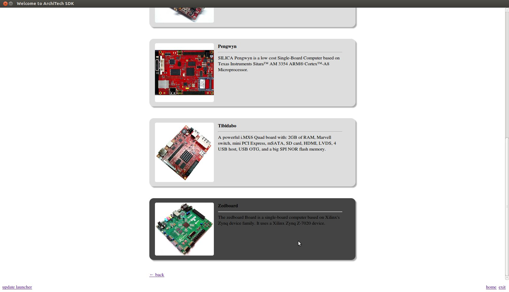
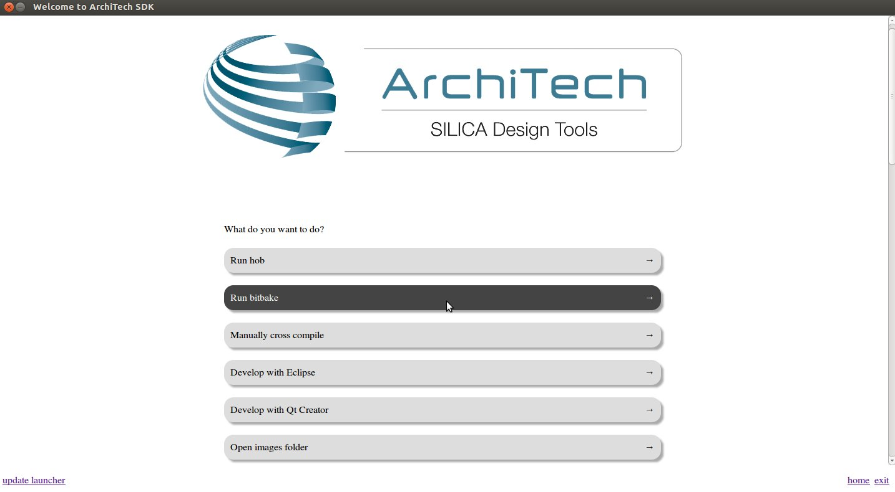
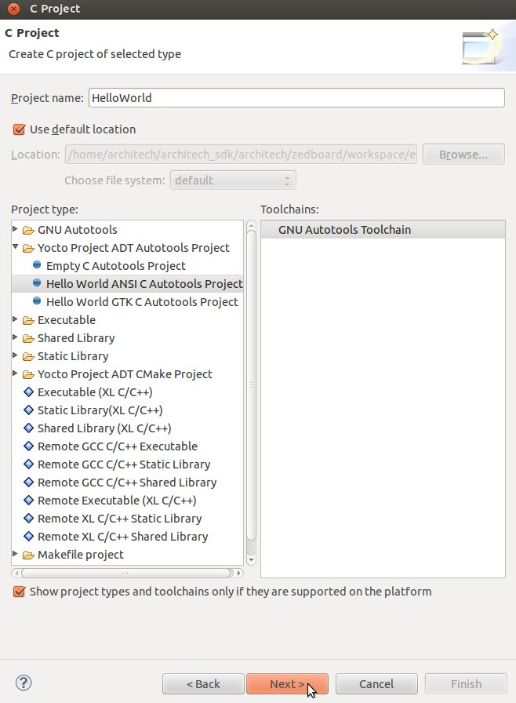

.. _quick:

*****************
Quick start guide
*****************

This document will guide you from importing the virtual machine to debugging an *Hello World!* example on a customized Linux distribution you will generate with **OpenEmbedded**/**Yocto** toolchain.

Install
=======
.. include:: vdi.rst

Build
=====

.. important::

 A working internet connection, several GB of free disk space and several hours are required by the build process

1. Select Architech's virtual machine from the list of virtual machines inside Virtual Box application

.. image:: _static/vdi_machine_listed.png
    :align: center

2. Click on the icon *Start* button in the toolbar and wait until the virtual machine is ready

.. image:: _static/vbStart.png
    :align: center

3. Double click on *Architech SDK* icon you have on the virtual machine desktop.

.. image:: _static/splash0.jpg
    :align: center

4. The first screen gives you two choices: *ArchiTech* and *3rd Party*. Choose *ArchiTech*.

.. image:: _static/splash1.jpg
    :align: center

5. Select ZedBoard as board you want develop on. 

6. A new screen opens up from where you can perform a set of actions. Click on *Run bitbake* to obtain a terminal ready to start to build an image.

7. Open *local.conf* file:

.. raw:: html

 

 
<b class="admonition-host">&nbsp;&nbsp;Host&nbsp;&nbsp;</b>&nbsp;&nbsp;<a style="float: right;" href="javascript:select_text( 'quick_rst-host-201' );">select</a>

 <pre class="line-numbers pre-replacer" data-start="1"><code id="quick_rst-host-201" class="language-markup">gedit conf/local.conf</code></pre>
 
 
 

8. Go to the end of the file and add the following lines:

.. raw:: html

 

 
<b class="admonition-host">&nbsp;&nbsp;Host&nbsp;&nbsp;</b>&nbsp;&nbsp;<a style="float: right;" href="javascript:select_text( 'quick_rst-host-202' );">select</a>

 <pre class="line-numbers pre-replacer" data-start="1"><code id="quick_rst-host-202" class="language-markup">EXTRA_IMAGE_FEATURES_append = " tools-debug debug-tweaks"
 IMAGE_INSTALL_append = " tcf-agent"</code></pre>
 
 
 

This will trigger the installation of a features set onto the final root file system, like *tcf-agent* and *gdbserver*.

9. Save the file and close gedit.

10. Build *core-image-minimal-dev* image by means of the following command:

.. raw:: html

 

 
<b class="admonition-host">&nbsp;&nbsp;Host&nbsp;&nbsp;</b>&nbsp;&nbsp;<a style="float: right;" href="javascript:select_text( 'quick_rst-host-203' );">select</a>

 <pre class="line-numbers pre-replacer" data-start="1"><code id="quick_rst-host-203" class="language-markup">bitbake core-image-minimal-dev</code></pre>
 
 
 

At the end of the build process, the image will be saved inside directory:

.. raw:: html

 

 
<b class="admonition-host">&nbsp;&nbsp;Host&nbsp;&nbsp;</b>&nbsp;&nbsp;<a style="float: right;" href="javascript:select_text( 'quick_rst-host-204' );">select</a>

 <pre class="line-numbers pre-replacer" data-start="1"><code id="quick_rst-host-204" class="language-markup">/home/architech/architech_sdk/architech/zedboard/yocto/build/tmp/deploy/images/zedboard-zynq7</code></pre>
 
 
 

11. Setup *sysroot* directory on your host machine:

.. raw:: html

 

 
<b class="admonition-host">&nbsp;&nbsp;Host&nbsp;&nbsp;</b>&nbsp;&nbsp;<a style="float: right;" href="javascript:select_text( 'quick_rst-host-205' );">select</a>

 <pre class="line-numbers pre-replacer" data-start="1"><code id="quick_rst-host-205" class="language-markup">sudo tar -xzf /home/architech/architech_sdk/architech/zedboard/yocto/build/tmp/deploy/images/zedboard-zynq7/core-image-minimal-dev-zedboard-zynq7.tar.gz -C /home/architech/architech_sdk/architech/zedboard/sysroot/</code></pre>
 
 
 

.. note::

 **sudo** password is: "**architech**"

.. _quick_deploy_rootfs_label:

Deploy
======

.. include:: deploy_rootfs.rst

Boot
====

.. include:: quick_boot.rst

Code
====

The time to create a simple *HelloWorld!* application using **Eclipse** has come. 

1. Return to the **Splashscreen**, which we left on ZedBoard board screen, and click on *Develop with Eclipse*.

2. Go to *File→ New→ Project*, select *C/C++→ C Project* and press *next* button.

.. image:: _static/eclipse-newprj1.jpg
    :align: center

3. Insert *HelloWorld* as project name, select *Hello World ANSI C Autotools Project* and press *next* button.

4. Insert *Author* field and click on *Finish* button. Select *Yes* on the *Open Associated Perspective?* question.

5. Build the project by selecting *Project→ Build All*.

Debug
=====

Use an ethernet cable to connect the board (connector J11) to your PC.
Configure your workstation ip address as 192.168.0.100.
Make sure the board can be seen by your host machine:

.. raw:: html

 

 
<b class="admonition-board">&nbsp;&nbsp;Board&nbsp;&nbsp;</b>&nbsp;&nbsp;<a style="float: right;" href="javascript:select_text( 'quick_rst-board-261' );">select</a>

 <pre class="line-numbers pre-replacer" data-start="1"><code id="quick_rst-board-261" class="language-markup">ifconfig eth0 192.168.0.10</code></pre>
 
 
 

.. raw:: html

 

 
<b class="admonition-host">&nbsp;&nbsp;Host&nbsp;&nbsp;</b>&nbsp;&nbsp;<a style="float: right;" href="javascript:select_text( 'quick_rst-host-206' );">select</a>

 <pre class="line-numbers pre-replacer" data-start="1"><code id="quick_rst-host-206" class="language-markup">ping 192.168.0.10</code></pre>
 
 
 

If the output is similar to this one:

.. raw:: html

 

 
<b class="admonition-host">&nbsp;&nbsp;Host&nbsp;&nbsp;</b>&nbsp;&nbsp;<a style="float: right;" href="javascript:select_text( 'quick_rst-host-207' );">select</a>

 <pre class="line-numbers pre-replacer" data-start="1"><code id="quick_rst-host-207" class="language-markup">64 bytes from 192.168.0.100: icmp_req=1 ttl=64 time=0.946 ms
 64 bytes from 192.168.0.100: icmp_req=2 ttl=64 time=0.763 ms
 64 bytes from 192.168.0.100: icmp_req=3 ttl=64 time=0.671 ms
 64 bytes from 192.168.0.100: icmp_req=4 ttl=64 time=0.793 ms</code></pre>
 
 
 

then the ethernet connection is ok. Enable the remote debug with Yocto by typing this command on ZedBoard console:

.. raw:: html

 

 
<b class="admonition-board">&nbsp;&nbsp;Board&nbsp;&nbsp;</b>&nbsp;&nbsp;<a style="float: right;" href="javascript:select_text( 'quick_rst-board-262' );">select</a>

 <pre class="line-numbers pre-replacer" data-start="1"><code id="quick_rst-board-262" class="language-markup">/etc/init.d/tcf-agent restart</code></pre>
 
 
 

On the Host machine, follow these steps to let **Eclipse** deploy and debug your application:

* Select Run→ Debug Configurations...
* In the left area, expand *C/C++Remote Application*.
* Locate your project and select it to bring up a new tabbed view in the *Debug Configurations* Dialog.

.. image:: _static/debugform.jpg
    :align: center

* Insert in *C/C++ Application* the filepath (on your host machine) of the compiled binary.
* Click on *New* button near the drop-down menu in the *Connection* field.
* Select *TCF* icon.

.. image:: _static/tcf1.jpg
    :align: center

* Insert in *Host Name* and *Connection Name* fields the IP address of the target board. (e.g. 192.168.0.10)

.. image:: _static/tcf2.jpg
    :align: center

* Then press *Finish*.

* Use the drop-down menu now in the *Connection* field and pick up the IP Address you entered earlier.

* Enter the absolute path on the target into which you want to deploy the cross-compiled application. Use the *Browse* button near *Remote Absolute File Path for C/C++Application:* field. No password is needed.

.. image:: _static/remotepath.jpg
    :align: center

* Enter also in the path the name of the application you want to debug. (e.g. Hello)

.. image:: _static/debug2.jpg
    :align: center

* Select *Debugger* tab

.. image:: _static/gdb.jpg
    :align: center

* In GDB Debugger field, insert the filepath of gdb for your toolchain

.. raw:: html

 

 
<b class="admonition-host">&nbsp;&nbsp;Host&nbsp;&nbsp;</b>&nbsp;&nbsp;<a style="float: right;" href="javascript:select_text( 'quick_rst-host-208' );">select</a>

 <pre class="line-numbers pre-replacer" data-start="1"><code id="quick_rst-host-208" class="language-markup">/home/architech/architech_sdk/architech/zedboard/toolchain/sysroots/i686-pokysdk-linux/usr/bin/arm-poky-linux-gnueabi/arm-poky-linux-gnueabi-gdb</code></pre>
 
 
 

* In *Debugger* window there is a tab named *Shared Library*, click on it.
* Add the libraries paths *lib* and *usr/lib* of the rootfs (which must be the same used in the target board)

.. raw:: html

 

 
<b class="admonition-host">&nbsp;&nbsp;Host&nbsp;&nbsp;</b>&nbsp;&nbsp;<a style="float: right;" href="javascript:select_text( 'quick_rst-host-209' );">select</a>

 <pre class="line-numbers pre-replacer" data-start="1"><code id="quick_rst-host-209" class="language-markup">/home/architech/architech_sdk/architech/zedboard/sysroot/lib
 /home/architech/architech_sdk/architech/zedboard/sysroot/usr/lib</code></pre>
 
 
 

* Click *Debug* to login.
* Accept the debug perspective. 

.. important::

 If debug does not work, check on the board if *tcf-agent* is running and *gdbserver* has been installed.