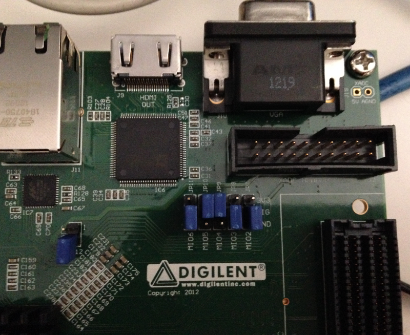

Make sure that ZedBoard boot mode (JP7-JP11) and MIO0 (JP6) jumpers are set like in the following picture:

Insert the SD card you just prepared inside socket **J12**.

Connect the external power adapter to ZedBoard connector **J20** and move switch **SW8** to the "On" position.

And now proceed by setting up the serial console.

.. include:: serial_console.rst

Give *root* to the login prompt:

.. board::

 zedboard-zynq7 login: root

and press *Enter*.

.. note::

 Sometimes, the time you spend setting up minicom makes you miss all the output that leads to the login and you see just a black screen, press *Enter* then to get the login prompt.
