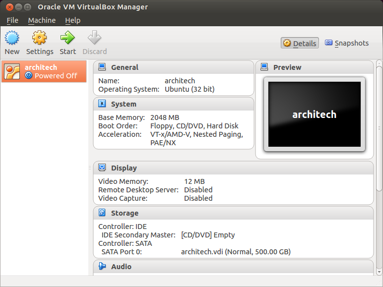
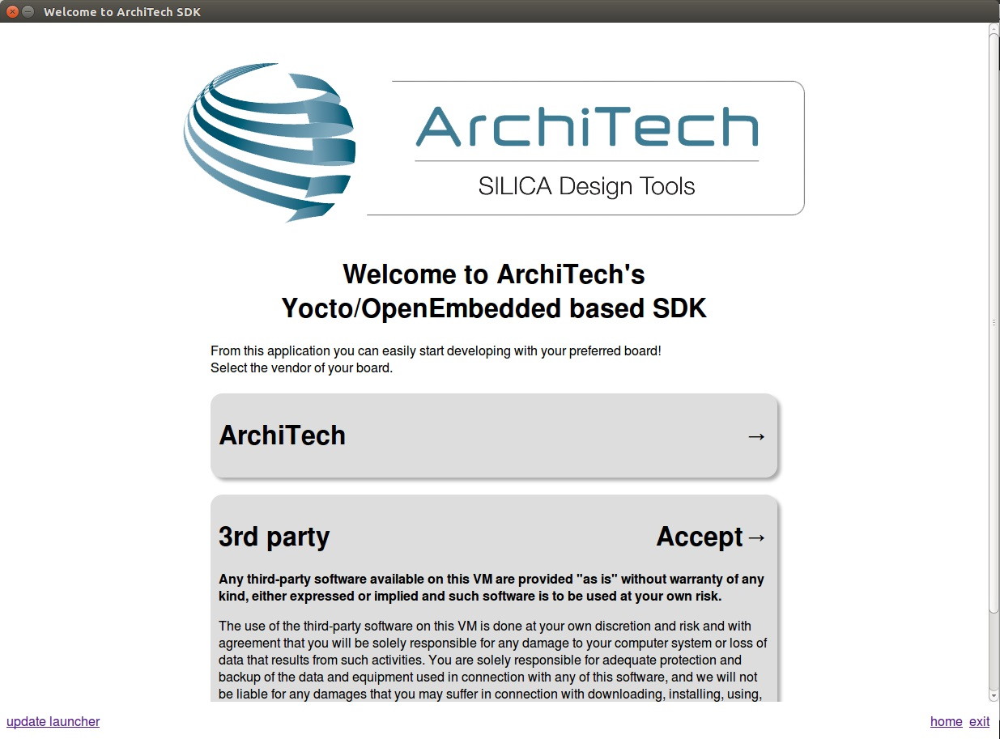

.. important::

 A working internet connection, several GB of free disk space and several hours are required by the build process

1. Select Architech's virtual machine from the list of virtual machines inside Virtual Box application

2. Click on the icon *Start* button in the toolbar and wait until the virtual machine is ready

.. image:: _static/vbStart.png
    :align: center

3. Double click on *Architech SDK* icon you have on the virtual machine desktop.

.. image:: _static/splash0.jpg
    :align: center

4. The first screen gives you two choices: *ArchiTech* and *3rd Party*. Choose *ArchiTech*.

5. Select ZedBoard as board you want develop on. 

.. image:: _static/splashscreen_board_selection.jpg
    :align: center

6. A new screen opens up from where you can perform a set of actions. Click on *Run bitbake* to obtain a terminal ready to start to build an image.

.. image:: _static/splash3.jpg
    :align: center

7. Open *local.conf* file:

.. raw:: html

 

 
<b class="admonition-host">&nbsp;&nbsp;Host&nbsp;&nbsp;</b>&nbsp;&nbsp;<a style="float: right;" href="javascript:select_text( 'quick_build_rst-host-31' );">select</a>

 <pre class="line-numbers pre-replacer" data-start="1"><code id="quick_build_rst-host-31" class="language-markup">gedit conf/local.conf</code></pre>
 
 
 

8. Go to the end of the file and add the following lines:

.. raw:: html

 

 
<b class="admonition-host">&nbsp;&nbsp;Host&nbsp;&nbsp;</b>&nbsp;&nbsp;<a style="float: right;" href="javascript:select_text( 'quick_build_rst-host-32' );">select</a>

 <pre class="line-numbers pre-replacer" data-start="1"><code id="quick_build_rst-host-32" class="language-markup">EXTRA_IMAGE_FEATURES_append = " tools-debug debug-tweaks"
 IMAGE_INSTALL_append = " tcf-agent"</code></pre>
 
 
 

This will trigger the installation of a features set onto the final root file system, like *tcf-agent* and *gdbserver*.

9. Save the file and close gedit.

10. Build *core-image-minimal-dev* image by means of the following command:

.. raw:: html

 

 
<b class="admonition-host">&nbsp;&nbsp;Host&nbsp;&nbsp;</b>&nbsp;&nbsp;<a style="float: right;" href="javascript:select_text( 'quick_build_rst-host-33' );">select</a>

 <pre class="line-numbers pre-replacer" data-start="1"><code id="quick_build_rst-host-33" class="language-markup">bitbake core-image-minimal-dev</code></pre>
 
 
 

At the end of the build process, the image will be saved inside directory:

.. raw:: html

 

 
<b class="admonition-host">&nbsp;&nbsp;Host&nbsp;&nbsp;</b>&nbsp;&nbsp;<a style="float: right;" href="javascript:select_text( 'quick_build_rst-host-34' );">select</a>

 <pre class="line-numbers pre-replacer" data-start="1"><code id="quick_build_rst-host-34" class="language-markup">/home/architech/architech_sdk/architech/zedboard/yocto/build/tmp/deploy/images/zedboard-zynq7</code></pre>
 
 
 

11. Setup *sysroot* directory on your host machine:

.. raw:: html

 

 
<b class="admonition-host">&nbsp;&nbsp;Host&nbsp;&nbsp;</b>&nbsp;&nbsp;<a style="float: right;" href="javascript:select_text( 'quick_build_rst-host-35' );">select</a>

 <pre class="line-numbers pre-replacer" data-start="1"><code id="quick_build_rst-host-35" class="language-markup">sudo tar -xzf /home/architech/architech_sdk/architech/zedboard/yocto/build/tmp/deploy/images/zedboard-zynq7/core-image-minimal-dev-zedboard-zynq7.tar.gz -C /home/architech/architech_sdk/architech/zedboard/sysroot/</code></pre>
 
 
 

.. note::

 **sudo** password is: "**architech**"