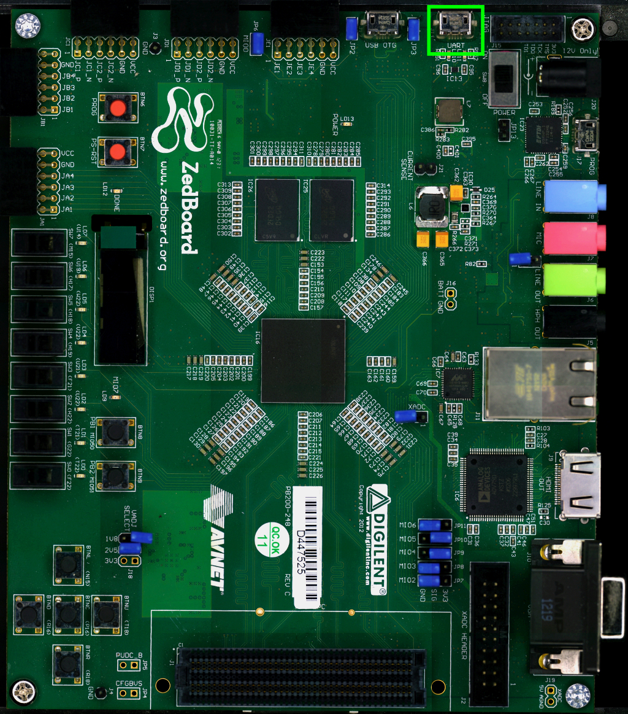

On ZedBoard there is an USB-UART port (**J14**) labeled **UART**

which you can connect, by means of a micro-USB cable, to your personal computer.

.. note::

 Every operating system has its own killer application to give you a serial terminal interface. In this guide, we are assuming your **host** operating system is **Ubuntu**.

On a Linux (Ubuntu) host machine, the console is seen as a ttyACMX device and you can access to it by means
of an application like *minicom*.

*Minicom* needs to know the name of the serial device. The simplest way for you to discover
the name of the device is by looking to the kernel messages, so:

1. clean the kernel messages

.. raw:: html

 

 
<b class="admonition-host">&nbsp;&nbsp;Host&nbsp;&nbsp;</b>&nbsp;&nbsp;<a style="float: right;" href="javascript:select_text( 'serial_console_rst-host-121' );">select</a>

 <pre class="line-numbers pre-replacer" data-start="1"><code id="serial_console_rst-host-121" class="language-markup">sudo dmesg -c</code></pre>
 
 
 

2. connect the mini-USB cable to the board already powered-on

3. display the kernel messages

.. raw:: html

 

 
<b class="admonition-host">&nbsp;&nbsp;Host&nbsp;&nbsp;</b>&nbsp;&nbsp;<a style="float: right;" href="javascript:select_text( 'serial_console_rst-host-122' );">select</a>

 <pre class="line-numbers pre-replacer" data-start="1"><code id="serial_console_rst-host-122" class="language-markup">dmesg</code></pre>
 
 
 

3. read the output

.. raw:: html

 

 
<b class="admonition-host">&nbsp;&nbsp;Host&nbsp;&nbsp;</b>&nbsp;&nbsp;<a style="float: right;" href="javascript:select_text( 'serial_console_rst-host-123' );">select</a>

 <pre class="line-numbers pre-replacer" data-start="1"><code id="serial_console_rst-host-123" class="language-markup">[29629.785374] usb 3-2: &gt;new full-speed USB device number 4 using xhci_hcd
 [29629.806908] usb 3-2: &gt;New USB device found, idVendor=04b4, idProduct=0008
 [29629.806915] usb 3-2: &gt;New USB device strings: Mfr=1, Product=2, SerialNumber=4
 [29629.806919] usb 3-2: &gt;Product: Cypress-USB2UART-0123456
 [29629.806922] usb 3-2: &gt;Manufacturer: 2012 Cypress Semiconductor
 [29629.806925] usb 3-2: &gt;SerialNumber: 0201258B0816
 [29629.858654] cdc_acm 3-2:1.0: &gt;This device cannot do calls on its own. It is not a modem.
 [29629.858705] cdc_acm 3-2:1.0: &gt;ttyACM0: USB ACM device
 [29629.859345] usbcore: registered new interface driver cdc_acm
 [29629.859347] cdc_acm: USB Abstract Control Model driver for USB modems and ISDN adapters</code></pre>
 
 
 

As you can see, here the device has been recognized as **/dev/ttyACM0**.

Now that you know the device name, run *minicom*:

.. raw:: html

 

 
<b class="admonition-host">&nbsp;&nbsp;Host&nbsp;&nbsp;</b>&nbsp;&nbsp;<a style="float: right;" href="javascript:select_text( 'serial_console_rst-host-124' );">select</a>

 <pre class="line-numbers pre-replacer" data-start="1"><code id="serial_console_rst-host-124" class="language-markup">sudo minicom -ws</code></pre>
 
 
 

If minicom is not installed, you can install it with:

.. raw:: html

 

 
<b class="admonition-host">&nbsp;&nbsp;Host&nbsp;&nbsp;</b>&nbsp;&nbsp;<a style="float: right;" href="javascript:select_text( 'serial_console_rst-host-125' );">select</a>

 <pre class="line-numbers pre-replacer" data-start="1"><code id="serial_console_rst-host-125" class="language-markup">sudo apt-get install minicom</code></pre>
 
 
 

then you can setup your port with these parameters:

.. raw:: html

 

 
<b class="admonition-host">&nbsp;&nbsp;Host&nbsp;&nbsp;</b>&nbsp;&nbsp;<a style="float: right;" href="javascript:select_text( 'serial_console_rst-host-126' );">select</a>

 <pre class="line-numbers pre-replacer" data-start="1"><code id="serial_console_rst-host-126" class="language-markup">+-----------------------------------------------------------------------+
 | A -    Serial Device      : /dev/ttyACM0                              |
 | B - Lockfile Location     : /var/lock                                 |
 | C -   Callin Program      :                                           |
 | D -  Callout Program      :                                           |
 | E -    Bps/Par/Bits       : 115200 8N1                                |
 | F - Hardware Flow Control : No                                        |
 | G - Software Flow Control : No                                        |
 |                                                                       |
 |    Change which setting?                                              |
 +-----------------------------------------------------------------------+
         | Screen and keyboard      |
         | Save setup as dfl        |
         | Save setup as..          |
         | Exit                     |
         | Exit from Minicom        |
         +--------------------------+</code></pre>
 
 
 

If on your system the device has not been recognized as */dev/ttyACM0*, just replace */dev/ttyACM0*
with the proper device.

Once you are done configuring the serial port, you are back to *minicom* main menu and you can select *exit*.
