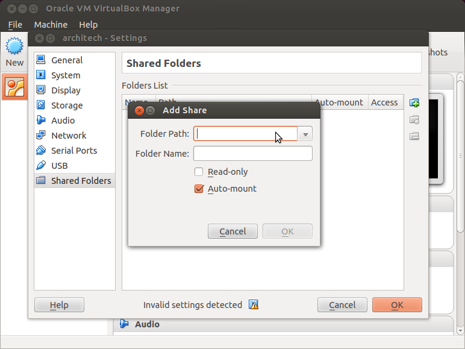

The development environment is provided as a virtual disk (to be used by a VirtualBox virtual machine)
which you can download from this page:

.. important::

 http://downloads.architechboards.com/sdk/virtual_machine/download.html

.. important::

 Compute the MD5SUM value of the zip file you downloaded and compare it to the golden one you find in the download page.

Uncompress the file, and you will get a *.vdi* file that is our virtual disk image.
The environment contains the SDK for all the boards provided by Architech, ZedBoard included.

Download VirtualBox
-------------------

.. image:: _static/vdi_virtualbox_logo.png
   :align: left

For being able to use it, you first need to install **VirtualBox** (version 4.2.10 or higher).
You can get VirtualBox installer from here:

https://www.virtualbox.org/wiki/Downloads

Download the version that suits your host operating system. You need to download and install the **Extension Pack** as well.

.. important::
 Make sure that the extension pack has the same version of VirtualBox.

Install the software with all the default options. 

Create a new Virtual Machine
----------------------------

1. Run VirtualBox

.. image:: _static/vdi_open_virtualbox.png
    :align: center

2. Click on *New* button

.. image:: _static/vdi_new_virtual_machine.png
    :align: center

3. Select the name of the virtual machine and the operating system type

.. image:: _static/vdi_virtual_machine_name.png
    :align: center

4. Select the amount of memory you want to give to your new virtual machine

.. image:: _static/vdi_virtual_machine_memory.png
    :align: center

5. Make the virtual machine use Architech's virtual disk by pointing to the downloaded file. Than click on *Create*.

Setup the network
-----------------

We need to setup a port forwarding rule to let you (later) use the virtual machine as a local repository of packages.

.. note::

 The virtual machine must be off

1. Select Architech's virtual machine from the list of virtual machines

.. image:: _static/vdi_machine_listed.png
    :align: center

2. Click on *Settings*

3. Select *Network*

.. image:: _static/vdi_network.png
    :align: center

4. Expand *Advanced* of *Adapter 1*

.. image:: _static/vdi_network_nat_advanced.png
    :align: center

5.  Click on *Port Forwarding*

.. image:: _static/vdi_network_nat_port_forwarding.png
    :align: center

6. Add a new *rule*

.. image:: _static/vdi_network_nat_port_forwarding_rule_add.png
    :align: center

7. Configure the *rule*

.. image:: _static/vdi_network_nat_port_forwarding_rule_added.png
    :align: center

8. Click on *Ok*

Customize the number of processors
----------------------------------

Building an entire system from the ground up is a business that can take up to several hours.
To improve the performances of the overall build process, you can, if your computer has enough resources, assign more than one
processor to the virtual machine.

.. note::

 The virtual machine must be off

1. Select Architech's virtual machine from the list of virtual machines

.. image:: _static/vdi_machine_listed.png
    :align: center

2. Click on *Settings*

3. Select *System*

4. Select *Processor*

5. Assign the number of processors you wish to assign to the virtual machine

Create a shared folder
----------------------

A shared folder is way for host and guest operating systems to exchange files by means of the file system.
You need to choose a directory on your host operating system to share with the guest operating system.

.. note::

 The virtual machine must be off

1. Select Architech's virtual machine from the list of virtual machines

.. image:: _static/vdi_machine_listed.png
    :align: center

2. Click on *Settings*

3. Select *Shared Folders*

4. Add a new shared folder

.. image:: _static/vdi_add_shared_folder.png
    :align: center

5. Choose a directory to share on your host machine. Make sure *Auto-mount* is selected.

Once the virtual machine has been booted, the shared folder will be mounted under */media/* directory inside the virtual machine.

