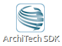
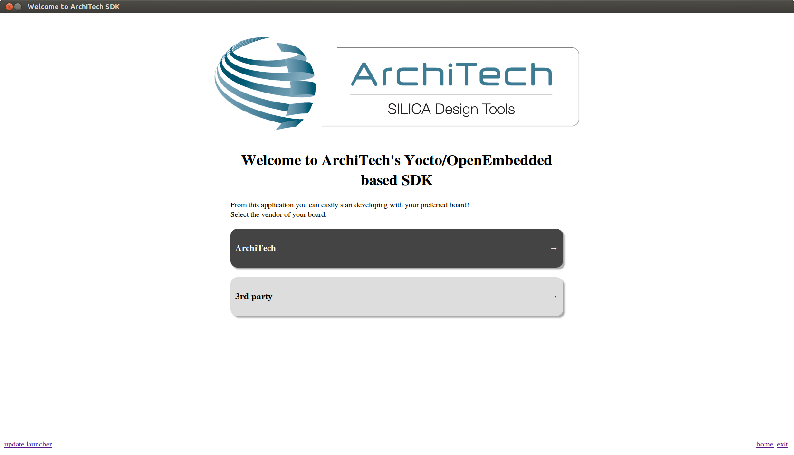
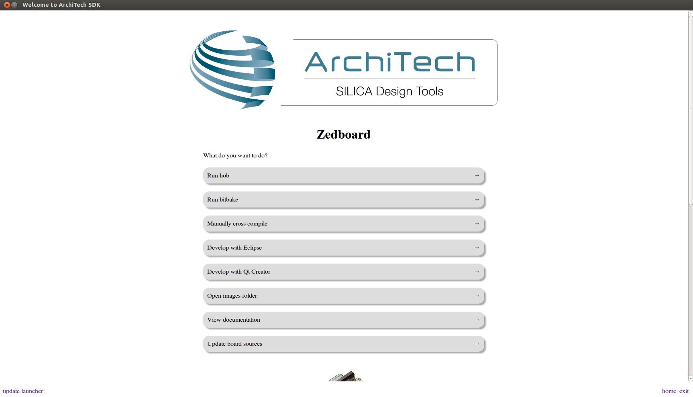

VM content
==========

The virtual machine provided by Architech contains:

* A splash screen, used to easily interact with the boards tools

* Yocto/OpenEmbedded toolchain to build BSPs and file systems

* A cross-toolchain (derived from Yocto/OpenEmbedded) for all the boards

* Eclipse, installed and configured

* Qt creator, installed and configured

All the aforementioned tools are installed under directory **/home/architech/architech_sdk**,
its sub-directories main layout is the following:

.. raw:: html

 

 
<b class="admonition-host">&nbsp;&nbsp;Host&nbsp;&nbsp;</b>&nbsp;&nbsp;<a style="float: right;" href="javascript:select_text( 'vm_layout_rst-host-101' );">select</a>

 <pre class="line-numbers pre-replacer" data-start="1"><code id="vm_layout_rst-host-101" class="language-markup">architech_sdk
     |
     |_ splashscreen
     |
     |_ spashscreen-interface
     |
     |_ architech-manifest
     |
     |_ architech
         |
         |_ ...
         |
         |_ zedboard
             |
             |_ eclipse
             |
             |_ java
             |
             |_ qtcreator
             |
             |_ splashscreen
             |
             |_ sysroot
             |
             |_ toolchain
             |
             |_ workspace
             |   |
             |   |_ eclipse
             |   |
             |   |_ qt
             |
             |_ yocto
                 |
                 |_ build
                 |
                 |_ poky
                 |
                 |_ meta-xilinx
                 |
                 |_ ...</code></pre>
 
 
 

**zedboard** directory contains all the tools composing the ArchiTech SDK for ZedBoard board,
along with all the information needed by the splash screen application. In particular:

* *eclipse* directory is where Eclipse IDE has been installed
* *java* directory is where the Java Virtual Machine has been installed (needed by Eclipse)
* *qtcreator* contains the installation of Qt Creator IDE
* *splashscreen* directory contains information and scripts used by the splash screen application,
* *sysroot* is supposed to contain the file system you want to compile against,
* *toolchain* is where the cross-toolchain has been installed installed
* *workspace* contains the the workspaces for Eclipse and Qt Creator IDEs
* *yocto* is where you find all the meta-layers ZedBoard requires, along with Poky and the build directory

Splash screen
-------------

The splash screen application has been designed to facilitate the access to the boards tools.
It can be opened by clicking on its *Desktop* icon.

Once started, you can can choose if you want to work with Architech's boards or with partners'
ones. For ZedBoard, choose **ArchiTech**.

A list of all available Architech's boards will open, select ZedBoard.

A list of actions related to ZedBoard that can be activated will appear.

