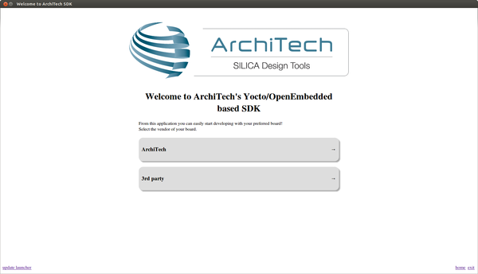
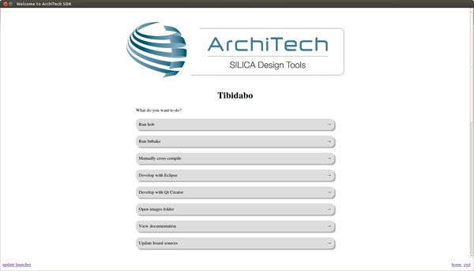

Virtual Machine content
=======================

The virtual machine provided by Architech contains:

* A splash screen, used to easily interact with the boards tools

* Yocto/OpenEmbedded toolchain to build BSPs and file systems

* A cross-toolchain (derived from Yocto/OpenEmbedded) for all the boards

* Eclipse, installed and configured

* Qt creator, installed and configured

All the aforementioned tools are installed under directory **architech_sdk**,
its sub-directories main layout is the following:

::

    architech_sdk
        |
        |_ splashscreen
        |
        |_ spashscreen-interface
        |
        |_ architech-manifest
        |
        |_ architech
            |
            |_ ...
            |
            |_ zedboard
                |
                |_ splashscreen
                |
                |_ sysroot
                |
                |_ toolchain
                |
                |_ yocto
                    |
                    |_ build
                    |
                    |_ meta-xilinx
                    |
                    |_ poky
                    |
                    |_ ...

**zedboard** directory contains all the tools and information needed by
the splash screen application. In particular:

* *splashscreen* directory contains information and scripts used by the splash screen application,
* *sysroot* is supposed to contain the file system you want to compile against,
* *toolchain* is where the toolchain is installed
* *yocto* is where you find all the meta-layers Zedboard requires, along with the build directory

Splash screen
-------------

The splash screen application has been designed to facilitate the access to the boards' tools.
It can be opened clicking on the *Desktop* icon.

.. image:: _static/splashscreen-icon.png
    :align: center   

Once started, you can can choose if you want to work with Architech's boards or with partners'
ones.

For Zedboard, choose **ArchiTech**.
A list of all available Architech's boards will open, select Zedboard.

A list of actions related to Zedboard that can be activated will appear.

