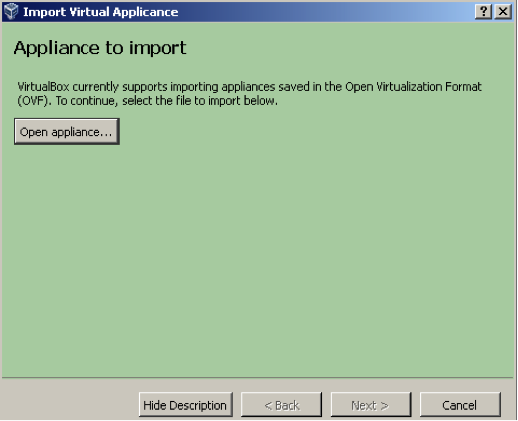
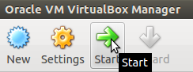
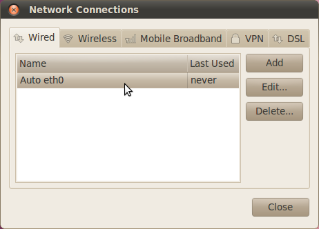
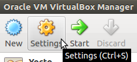

The development environment is provided as a Virtual Machine image. 

.. image:: _static/virtualboxlogo.png
   :align: left

For being able to use it, you first need to install **VirtualBox** (version 4.2.10 or higher), 
so, go to:

https://www.virtualbox.org/wiki/Downloads

and download the version that suits your host operating system. You need to download and install the Extension Pack as well.

.. important::
   Make sure that the extension pack has the same version of VirtualBox.

Install the software with all the default options and run it following these steps: 

.. tip::
   If you are using Linux, double click directly on the .ova file from your file explorer, click import button on the window that appears.
   Jump to step 3.

1. From the menu: *File→ Import Appliance*

2. Click on *Open appliance…* button and select the .ova file you downloaded.

3. Click on *Shared Folders* and select a folder to share with your host operating system. Make sure that **Auto-mount** checkbox is checked.
4. The ethernet card must be attached to the LAN, not to the WLAN (to make some test you will connect the board to the PC with an ethernet point-to-point connection). To set the correct card, go to menu *machine→ Settings*.
   Click on *Network* tab and select your LAN card. Double check also that the field *Attached to* is set to *Bridged Adapter*.
   Click on button *Ok* to apply your choices when you are done.

.. important::
   **sudo** password is **architech**

5. Click the icon *Start* button on the toolbar.

How to configure the network of the virtual machine
---------------------------------------------------

Another important thing to do is to set the IP address of the virtual machine as static. To do this follow the next steps inside the virtual machine:

1. Right-click on network connection icon. Select *Edit Connections...*.

2. In *Wired* tab, select *Auto eth0* and press *Edit...* button.

3. Click to *IPv4 Settings*, click on *Add* button and insert the following address:

* *Address*: 192.168.0.100

* *Netmask*: 255.255.255.0

Leave *Gateway* empty.

4. Click on Apply.

How to setup the number of processor cores and the amount of RAM used by your virtual machine
---------------------------------------------------------------------------------------------

To increase the performances of your virtual machine, you can configure the system settings. This is possible only if the virtual machine is off. First, select the Yocto based SDK virtual machine from the list of virtual machines, click on the  *Settings* icon in the *Oracle VM VirtualBox Manager* window:

In the left menu, click on *System*. In the *Motherboard* tab you can select how much **RAM** you want to assign to the virtual machine.
Select *Processor* tab to select how many processor **cores** you want to assign to the virtual machine.
